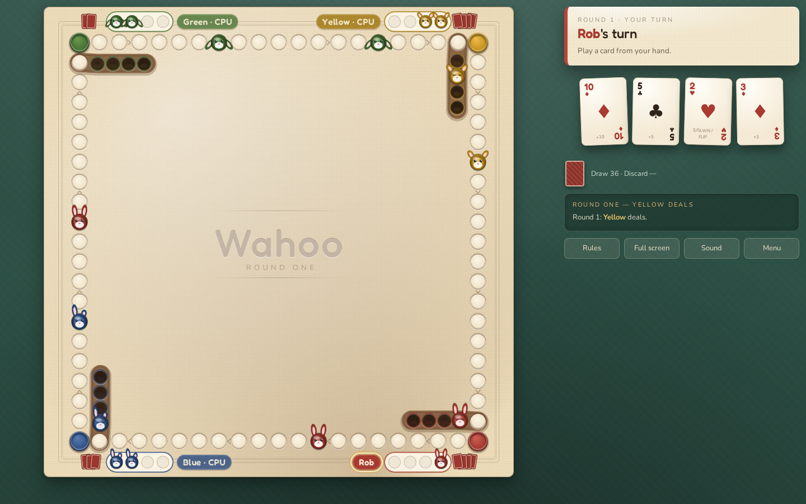

# 🐰 Wahoo

A 4-player team race board game built with [Pixi.js](https://pixijs.com). Two teams
of two maneuver their bunnies around the track and into their safe burrows —
stomping anyone who gets in the way.

**Play it:** https://robloach.github.io/wahoo/



## Features

- **Hot seat** — any mix of humans and CPU players on one device, with a
  pass-the-device curtain so nobody peeks at the next hand.
- **CPU players** — AI opponents with four difficulties: Easy always picks
  the worst move, Medium plays randomly, Hard plays the best move it can see,
  and Insane also anticipates the next player's reply (fair warning: it
  simulates against the real deck, so it effectively counts cards).
- **Animated moves** — bunnies hop space by space and the last move is
  highlighted, so you can always see what just happened.
- **Installable PWA** — add it to a phone home screen; hot-seat and CPU games
  work fully offline.
- **Reconnection** — refresh mid-game and rejoin your seat (a CPU covers for
  you meanwhile); a browser host can even close the tab and resume the room
  later. Invite links (`?join=CODE`) get friends in with one tap.
- **Online play, no server needed** — "Host a Game" runs the room right in the
  host's browser tab; friends join with a 5-letter code over WebRTC (PeerJS
  handles the handshake, then traffic flows peer-to-peer — on a shared LAN it
  stays local). Empty seats are filled by CPUs; if a player disconnects
  mid-game a CPU takes over.
- **Dedicated server option** — the same rooms can run on a Node WebSocket
  server for always-on hosting.

## The rules in brief

- Teams sit opposite each other: **Red & Green** vs **Blue & Yellow**. First team
  to house all 8 combined bunnies in their burrows wins.
- Each round every player is dealt 4 cards. On your turn play one card and do
  what it says (no drawing back up). If nothing in your hand is playable you
  discard your hand and sit out the round.
- Landing on any bunny stomps it back to its owner's reserve. Passing through
  doesn't stomp.
- **A / 2** spawn a bunny at Position 1 or move 1/2 (a 2 also flips a bonus card
  from the draw pile which you play too). **4** moves backward 4 spaces, staying
  on the track. **7** moves one bunny 7, or splits the 7 between two bunnies. **J**
  swaps one of your bunnies with any other active bunny. **Q** moves 12. **K**
  moves 13, or spawns from your reserve onto any other player's track bunny —
  even a teammate's — stomping it. Everything else moves its face value.
- Burrow entry needs an exact count, with no jumping inside the burrow: every
  slot passed through must be open. Once inside, bunnies are immune to
  everything.
- Once your own 4 bunnies are home, you keep receiving cards and move your
  teammate's bunnies on your turn.

## Development

```sh
npm install
npm run dev       # local dev server
npm test          # unit tests: rules engine, AI difficulties, rooms, views (vitest)
npm run build     # production build to dist/
npm run test:e2e  # browser tests (Playwright; build first)
npm run test:all  # everything: unit tests, build, then browser tests
```

Move and squash sound effects live in `src/assets/hop.wav` and
`src/assets/squash.wav` — replace those files (updating the imports in
`src/sounds.ts` if the format changes) to customize them.


## Online play

The default way to play online is **browser-hosted**: click *Host a Game* and
share the room code — no server required. The internet is only needed for the
initial PeerJS handshake; after that the game data flows directly between
browsers. When a strict NAT or firewall blocks the direct path, the connection
automatically falls back to a free TURN relay (traffic stays end-to-end
encrypted); swap in your own TURN credentials in `src/net/p2p.ts` if needed.

### Optional dedicated server

For an always-on room host, run the WebSocket server (Node ≥ 23.6):

```sh
npm run server           # listens on ws://localhost:8787
PORT=9000 npm run server
```

Then in the client's **Online Game** panel, enter the server address (for a
server behind HTTPS use `wss://…`), create a room, and share the room code.

## Deployment

Pushes to `main` build and deploy the client to GitHub Pages via
`.github/workflows/deploy.yml`.
